# Complete Filtering Flow

This document provides a comprehensive overview of the contact filtering pipeline, including all conditional branches and processing stages.

## Flow Diagram

```mermaid
flowchart TD
    START([Start Processing]) --> INIT[Initialize Processing<br/>5%]
    INIT --> LOAD[Load & Combine Input Files<br/>12-18%]
    LOAD --> STD[Standardize Columns<br/>22%]

    STD --> AUM_CHECK{AUM Merge<br/>Enabled?}
    AUM_CHECK -->|Yes| AUM_LOAD[Load Accounts Sheets]
    AUM_LOAD --> AUM_MERGE[Merge AUM Data<br/>28%]
    AUM_MERGE --> DEDUP
    AUM_CHECK -->|No| DEDUP

    DEDUP[Remove Duplicates<br/>35-40%] --> FIRM_EXCL_CHECK{Firm Exclusion<br/>Enabled?}

    FIRM_EXCL_CHECK -->|Yes| FIRM_EXCL[Apply Firm Exclusion<br/>45%]
    FIRM_EXCL --> FIRM_INCL_CHECK
    FIRM_EXCL_CHECK -->|No| FIRM_INCL_CHECK

    FIRM_INCL_CHECK{Firm Inclusion<br/>List Configured?}
    FIRM_INCL_CHECK -->|Yes| FIRM_INCL[Apply Firm Inclusion<br/>46%]
    FIRM_INCL --> CONTACT_EXCL_CHECK
    FIRM_INCL_CHECK -->|No| CONTACT_EXCL_CHECK

    CONTACT_EXCL_CHECK{Contact Exclusion<br/>List Configured?}
    CONTACT_EXCL_CHECK -->|Yes| CONTACT_EXCL[Apply Contact Exclusion<br/>47%]
    CONTACT_EXCL --> ACCOUNT_REMOVAL_CHECK
    CONTACT_EXCL_CHECK -->|No| ACCOUNT_REMOVAL_CHECK

    ACCOUNT_REMOVAL_CHECK{Account Removal<br/>List Active?}
    ACCOUNT_REMOVAL_CHECK -->|Yes| ACCOUNT_REMOVAL[Apply Account Removal<br/>48%]
    ACCOUNT_REMOVAL --> CONTACT_REMOVAL_CHECK
    ACCOUNT_REMOVAL_CHECK -->|No| CONTACT_REMOVAL_CHECK

    CONTACT_REMOVAL_CHECK{Contact Removal<br/>List Active?}
    CONTACT_REMOVAL_CHECK -->|Yes| CONTACT_REMOVAL[Apply Contact Removal<br/>50%]
    CONTACT_REMOVAL --> FIELD_FILTER_CHECK
    CONTACT_REMOVAL_CHECK -->|No| FIELD_FILTER_CHECK

    FIELD_FILTER_CHECK{Field Filters<br/>Configured?}
    FIELD_FILTER_CHECK -->|Yes| FIELD_FILTER[Apply Field Filters<br/>52%]
    FIELD_FILTER --> TIER_CONFIG
    FIELD_FILTER_CHECK -->|No| TIER_CONFIG

    TIER_CONFIG[Configure Tier Filters] --> TIER1[Apply Tier 1 Filter<br/>55%]
    TIER1 --> TIER2[Apply Tier 2 Filter<br/>62%]
    TIER2 --> TIER_RESULT[Tier Results<br/>68%]

    TIER_RESULT --> CONTACT_INCL_CHECK{Contact Inclusion<br/>Enabled?}
    CONTACT_INCL_CHECK -->|Yes| CONTACT_INCL[Apply Contact Inclusion]
    CONTACT_INCL --> EMAIL_CHECK
    CONTACT_INCL_CHECK -->|No| EMAIL_CHECK

    EMAIL_CHECK{Find Emails<br/>Enabled?}
    EMAIL_CHECK -->|Yes| EMAIL_EXTRACT[Extract Email Patterns<br/>72%]
    EMAIL_EXTRACT --> EMAIL_FILL[Fill Missing Emails]
    EMAIL_FILL --> DELTA
    EMAIL_CHECK -->|No| DELTA

    DELTA[Create Delta Analysis<br/>80%] --> RESCUE_CHECK{Include All<br/>Firms?}

    RESCUE_CHECK -->|Yes| RESCUE[Rescue Excluded Firms<br/>Tier 3]
    RESCUE --> EMAIL_RESCUE_CHECK{Find Emails &<br/>Has Rescued?}
    EMAIL_RESCUE_CHECK -->|Yes| RESCUE_EMAIL[Fill Rescued Emails]
    RESCUE_EMAIL --> ANNOTATE
    EMAIL_RESCUE_CHECK -->|No| ANNOTATE
    RESCUE_CHECK -->|No| ANNOTATE

    ANNOTATE[Annotate Email Status] --> ANALYTICS[Extract Analytics<br/>85%]

    ANALYTICS --> OUTPUT_CHECK{Separate by<br/>Firm Type?}
    OUTPUT_CHECK -->|Yes| OUTPUT_SEPARATED[Create Separated Files<br/>+ ZIP<br/>90-95%]
    OUTPUT_CHECK -->|No| OUTPUT_SINGLE[Create Single Excel<br/>90-95%]

    OUTPUT_SEPARATED --> COMPLETE
    OUTPUT_SINGLE --> COMPLETE

    COMPLETE([Processing Complete<br/>100%])

    style START fill:#90EE90
    style COMPLETE fill:#90EE90
    style TIER1 fill:#FFB6C1
    style TIER2 fill:#FFB6C1
    style RESCUE fill:#ADD8E6
```



## Detailed Stage Descriptions

### 1. Initialization (5%)
- Configure filter instance settings
- Set tier limits (Tier 1, Tier 2)
- Enable/disable features (firm exclusion, contact inclusion, find emails)
- Create progress callback

### 2. Load Input Files (10-18%)
- Load all uploaded Excel files
- Combine contacts from multiple files
- Create filename mappings for analytics

### 3. Standardize Columns (22%)
- Map various column names to standard format
- Standard columns: NAME, INVESTOR, JOB_TITLE, EMAIL, ROLE, COUNTRY, CITY, etc.
- Handle column variations (e.g., "Full Name" -> "NAME")

### 4. AUM Data Merge (28%) - *Optional*
**Condition:** `enableAumMerge` setting is true (default: true)

- Load "Accounts" sheets from input files
- Match contacts to accounts by firm name
- Merge AUM (Assets Under Management) data into contact records
- Track merge statistics

### 5. Deduplication (35-40%)
- Remove duplicate contacts based on:
  - Name + Firm combination
  - Email address
- Keep highest priority contact when duplicates found

---

## Exclusion Filter Chain (45-52%)

### 6. Firm Exclusion (45%) - *Optional*
**Condition:** `firmExclusion` setting is true

- Load firm exclusion list from `exclude_firms.csv`
- Remove all contacts from excluded firms
- Normalized matching (case-insensitive, punctuation removed)

### 7. Firm Inclusion (46%) - *Optional*
**Condition:** `firmInclusionList` is configured

- Only keep contacts from firms in the inclusion list
- Useful for targeting specific accounts
- Normalized matching

### 8. Contact Exclusion (47%) - *Optional*
**Condition:** `contactExclusionList` is configured

- Remove specific contacts by Name|Firm combination
- Format: `Name|Firm` per line
- Normalized matching

### 9. Account Removal List (48%) - *Optional*
**Condition:** Active account removal CSV is uploaded

- Remove contacts from accounts in the removal list
- **Phase 1:** Exact match (O(1) lookup)
- **Phase 2:** Substring containment for partial matches
- Tracks removed records for delta analysis

### 10. Contact Removal List (50%) - *Optional*
**Condition:** Active contact removal CSV is uploaded

- Remove specific contacts by email OR name+account
- **Phase 1:** Exact email match (O(1) lookup)
- **Phase 2:** Exact name+account match
- Tracks removed records for delta analysis

### 11. Field Filters (52%) - *Optional*
**Condition:** `fieldFilters` array is configured

Supported fields:
- COUNTRY
- CITY
- ASSET_CLASS
- FIRM_TYPE
- Any other column in data

Vectorized matching using pandas `.isin()` for performance.

---

## Tier Filtering (55-68%)

### 12. Tier 1 Filtering (55%)
**Target:** Senior decision makers and key investment professionals

Default criteria:
- **Include Keywords:** cio, chief investment officer, portfolio manager, director, head, managing director, partner, principal, president, vp, vice president, senior
- **Exclude Keywords:** operations, hr, marketing, legal, compliance, it, technology, admin, assistant, coordinator, secretary, receptionist
- **Require Investment Team:** false (configurable)
- **Limit:** 10 contacts per firm (configurable)

Selection priority:
1. Match job title against include keywords
2. Filter out exclude keywords
3. Check investment team requirement (if enabled)
4. Sort by priority score
5. Take top N per firm

### 13. Tier 2 Filtering (62%)
**Target:** Junior investment professionals

Default criteria:
- **Include Keywords:** analyst, associate, director, manager, investment
- **Exclude Keywords:** operations, hr, marketing, legal, compliance, it, technology, admin, assistant, coordinator, secretary, receptionist
- **Require Investment Team:** true (default)
- **Limit:** 6 contacts per firm (configurable)

---

## Post-Tier Processing (68-85%)

### 14. Contact Inclusion (68%) - *Optional*
**Condition:** `contactInclusion` setting is true

- Force specific contacts into tiers regardless of filters
- Load from `include_contacts.csv`
- Contacts added even if they don't match tier criteria

### 15. Email Pattern Discovery (72%) - *Optional*
**Condition:** `findEmails` setting is true (default: true)

- Extract email patterns from known emails by firm
- Common patterns: `{first}.{last}@domain.com`, `{first}{last}@domain.com`, etc.
- Fill missing emails using discovered patterns
- Applies to Tier 1, Tier 2, and Tier 3 (rescued) contacts

### 16. Delta Analysis (80%)
Creates comprehensive tracking of all contacts showing:
- Processing status (Included, Filtered, Removed)
- Filter reason (which filter removed the contact)
- Final tier assignment
- Priority score

Includes contacts removed by:
- Account removal list
- Contact removal list
- Tier filters
- All other exclusion filters

---

## Firm Rescue (Tier 3) - *Optional*

### 17. Rescue Excluded Firms
**Condition:** `includeAllFirms` setting is true

- Find firms with zero contacts in Tier 1 or Tier 2
- Rescue top 1-3 contacts per firm based on priority scoring
- Only contacts with priority > 0 are rescued

Priority scoring factors:
- Job title keywords (CIO, CEO, CFO, Director, etc.)
- Role indicators
- Email availability

---

## Output Generation (85-100%)

### 18. Analytics Extraction (85%)
Extracts comprehensive analytics:
- Processing summary (counts, rates)
- Input file details
- Delta analysis
- Filter breakdown
- Excluded firms summary
- Firm type breakdown (if separated)
- AUM merge statistics

### 19. Output File Creation (90-95%)

#### Single File Mode (default)
Creates Excel with sheets:
- `Tier1_Key_Contacts`
- `Tier2_Junior_Contacts`
- `Tier3_Rescued_Contacts` (if Include All Firms enabled)

#### Separated by Firm Type Mode
**Condition:** `separateByFirmType` setting is true

Creates ZIP containing 6 Excel files:
1. `Insurance_Contacts.xlsx`
2. `Wealth_FamilyOffice_Contacts.xlsx`
3. `Pension_Contacts.xlsx`
4. `Foundation_Endowment_Contacts.xlsx`
5. `Institutional_Contacts.xlsx`
6. `Other_Contacts.xlsx`

Each file contains the same tier structure, filtered by firm type.

---

## Cancellation Points

The pipeline checks for cancellation at these points:
- After initialization
- After loading files
- After standardization
- After AUM merge
- After deduplication
- After each exclusion filter
- Before tier filtering
- After tier filtering
- Before email discovery
- Before output creation

Cancellation raises `RuntimeError("Job cancelled")` which is caught by the job handler.

---

## Progress Reporting

| Stage | Percent | Description |
|-------|---------|-------------|
| Initialize | 5% | Setting up filter configuration |
| Load files | 10-18% | Loading and combining input files |
| Standardize | 22% | Standardizing column names |
| AUM check | 28% | Checking for AUM data to merge |
| Dedup | 35-40% | Removing duplicate contacts |
| Firm exclusion | 45% | Applying firm exclusion filters |
| Firm inclusion | 46% | Applying firm inclusion filters |
| Contact exclusion | 47% | Applying contact exclusion list |
| Account removal | 48% | Applying account removal list |
| Contact removal | 50% | Applying contact removal list |
| Field filters | 52% | Applying field-based filters |
| Tier 1 | 55% | Applying Tier 1 filter |
| Tier 2 | 62% | Applying Tier 2 filter |
| Tier result | 68% | Tier filtering complete |
| Email patterns | 72% | Finding email patterns |
| Delta analysis | 80% | Creating delta analysis |
| Analytics | 85% | Extracting analytics |
| Output | 90-95% | Creating output file(s) |
| Complete | 100% | Processing complete |

---

## Data Flow Summary

```
Input Files (Excel)
       │
       ▼
┌─────────────────┐
│  Combined Data  │  (All contacts from all files)
└────────┬────────┘
         │
         ▼
┌─────────────────┐
│ Standardized    │  (Unified column names)
└────────┬────────┘
         │
         ▼
┌─────────────────┐
│ + AUM Data      │  (Optional merge)
└────────┬────────┘
         │
         ▼
┌─────────────────┐
│ Deduplicated    │  (Unique contacts)
└────────┬────────┘
         │
         ▼
┌─────────────────┐
│ Exclusion Chain │  (Firm/Contact/Field filters)
└────────┬────────┘
         │
         ├──────────────────────┬───────────────────┐
         ▼                      ▼                   ▼
┌─────────────────┐  ┌─────────────────┐  ┌─────────────────┐
│    Tier 1       │  │    Tier 2       │  │ Tier 3 (Rescue) │
│ Key Contacts    │  │ Junior Contacts │  │ Rescued Firms   │
└────────┬────────┘  └────────┬────────┘  └────────┬────────┘
         │                    │                    │
         └────────────────────┴────────────────────┘
                              │
                              ▼
                    ┌─────────────────┐
                    │  Output Excel   │
                    │  (or ZIP files) │
                    └─────────────────┘
```
